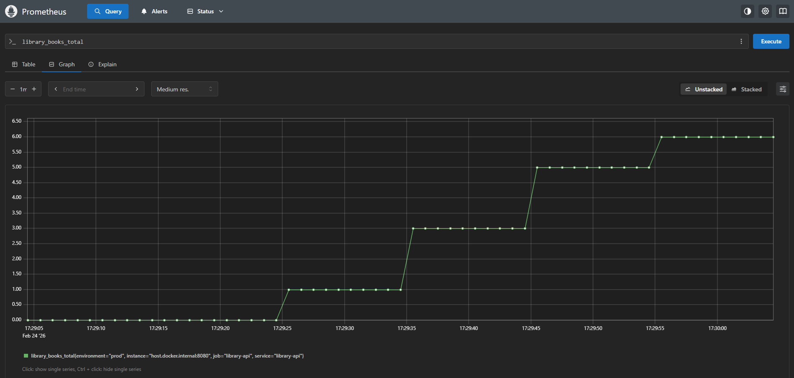

# 📚 Library API — Spring Boot 4 + JWT + Docker + Observability


[](https://sonarcloud.io/summary/new_code?id=library-api)
[](https://codecov.io/github/erichiroshi/library-api)


Backend production-ready projetado com foco em previsibilidade, observabilidade e isolamento de responsabilidades.

🔐 Autenticação JWT com Refresh Token Rotation  
🧠 Arquitetura em camadas bem definida  
🗄 PostgreSQL + Flyway (versionamento automático)  
⚡ Cache distribuído com Redis  
📊 Observabilidade completa (Micrometer + Prometheus + Grafana)  
🧪 Testes de integração com Testcontainers (banco real)  
🚀 CI/CD com quality gate obrigatório (80%+ cobertura)  

---

## 📑 Índice

- [Visão Geral](#-visão-geral)
- [Requisitos](#-requisitos)
- [Quick Start](#-quick-start)
  - [Modo Desenvolvimento](#-modo-desenvolvimento-recomendado-para-avaliação)
  - [Modo Produção](#-modo-produção-simulado)
- [Problema que Resolve](#-problema-que-este-projeto-resolve)  
- [Stack Tecnológica](#-stack-tecnológica)
- [Arquitetura](#-arquitetura)
- [Decisões Arquiteturais](#-decisões-arquiteturais)
- [Observabilidade](#-observabilidade)
- [Estratégia de Testes](#-estratégia-de-testes)
- [Endpoints Principais](#-endpoints-principais)
- [Métricas do Projeto](#-métricas-do-projeto)
- [Próximos Passos](#-próximos-passos)
- [Screenshots](#-screenshots)
- [Contribuições](#-como-contribuir)
- [Autor](#autor)

---

## 📋 Requisitos

### Obrigatórios
- **Docker** 20.10+ & **Docker Compose** 2.0+
- **Git** 2.30+

### Opcional (apenas para rodar fora do Docker)
- **Java 21 LTS** (OpenJDK ou Eclipse Temurin)
- **Gradle** 8.5+ (ou use o wrapper `./gradlew`)

### Verificar Instalação
```bash
docker --version          # Docker version 20.10+
docker compose version    # Docker Compose version 2.0+
git --version             # git version 2.30+
```

---

## 📑 Visão Geral

A **Library API** simula um backend de produção real para gerenciar livros, autores, categorias, usuários e empréstimos. 

---

## 🚀 Quick Start

O projeto possui dois modos de execução:

- **dev** → ambiente voltado para desenvolvimento e avaliação
- **prod** → ambiente containerizado simulando produção

---

### Clone o projeto

```bash
git clone https://github.com/erichiroshi/library-api.git
cd library-api
```

### 🟢 Modo Desenvolvimento (recomendado para avaliação)

Nesse modo a infraestrutura é executada via Docker e a aplicação pode ser iniciada via container ou IDE.

### 1️⃣ Subir infraestrutura

```bash
docker compose -f docker-compose.dev.yml up -d
```
A rede `library-api_backend` é criada automaticamente.

**Serviços iniciados:**
- PostgreSQL: `localhost:5432`
- Redis: `localhost:6379`
- pgAdmin: http://localhost:5050 (login `admin@admin.com` / `admin`)
- Prometheus: http://localhost:9090
- Grafana: http://localhost:3000 (login `admin` / `admin`)

### 2️⃣ Subir aplicação

**Opção A — Container:**
```bash
docker build -t library-api:latest .
docker run -d --network library-api_backend -p 8080:8080 --env-file .env.dev library-api:latest
```

**Opção B — IDE:**
```bash
./gradlew clean build
```
Refresh Gradle project → Executar a aplicação

**Acesse:**
- API: http://localhost:8080/api/v1
- Swagger: http://localhost:8080/swagger-ui/index.html

**Usuário admin para teste:**  
Email: joao.silva@email.com  
Senha: 123456

**Características do profile `dev`:**
- ✅ Swagger habilitado
- ✅ Banco de dados populado com seed inicial
- ✅ Configuração voltada para testes manuais
- ✅ Logs detalhados

## 🏭 Modo Produção (simulado)

Executa toda a stack containerizada utilizando o profile `prod`.

```bash
docker compose up -d
```
**Características do profile `prod`:**

- ✅ Swagger desabilitado
- ✅ Banco de dados inicial vazio
- ✅ Configuração mais restritiva
- ✅ Ambiente totalmente containerizado
- ✅ Stateless (JWT) + cache compartilhado (Redis)

**Populando banco em prod:**
```bash
docker exec -i library-api-postgres-1 psql -U postgres -d library < seed_realistic_dataset.sql
```

---

## 🧯 Encerrar ambiente

Para encerrar o ambiente:
```bash
docker compose down
```

Para remover volumes (apaga banco de dados):
```bash
docker compose down -v
```

---

## 📦 Postman Collection

Importe a collection para testar a API:

📁 `Library-API.postman_collection.json` (na raiz do projeto)

---

## 🎯 Problema que este Projeto Resolve

Este projeto vai além de um CRUD básico — ele **simula desafios reais de produção**:

### Cenário de Negócio
Uma biblioteca precisa:
- ✅ Gerenciar empréstimos com regras (limite de livros por usuário)
- ✅ Autenticar usuários de forma segura (JWT + Refresh Token)
- ✅ Garantir performance em consultas frequentes (Cache Redis)
- ✅ Monitorar saúde e métricas da aplicação (Observabilidade)
- ✅ Garantir qualidade de código (80%+ cobertura obrigatória)
- ✅ Evoluir schema sem quebrar produção (Flyway migrations)

### Diferenciais Técnicos
Não é apenas "funciona" — é **production-ready**:
- 🔐 Segurança: JWT com token rotation (previne replay attacks)
- ⚡ Performance: Cache distribuído com Redis
- 📊 Observabilidade: Prometheus + Grafana (dashboards prontos)
- 🧪 Qualidade: 80%+ cobertura com threshold obrigatório
- 🚀 CI/CD: Quality gate automático (SonarCloud)
- 🐳 DevOps: Docker Compose com 6 serviços orquestrados

---

## 🛠 Stack Tecnológica

### Core
- **Java 25 LTS**
- **Spring Boot**
  - Spring Web (API REST)
  - Spring Data JPA (persistência)
  - Spring Security (JWT)
  - Spring Cache (Redis)
- **Hibernate** (Mapeamento objeto-relacional)
- **Lombok** (Reduzir boilerplate)

### Persistência
- **PostgreSQL 16** (Banco relacional)
- **Flyway** (Versionamento de schema)

### Cache
- **Redis 7** (Cache distribuído)

### Observabilidade
- **Spring Actuator** (Health checks + métricas)
- **Micrometer** (Abstração de métricas)
- **Prometheus** (Coleta de métricas)
- **Grafana** (Dashboards visuais)

### Testes
- **Testcontainers** (PostgreSQL real em testes)
- **JUnit 5** (Framework de testes)
- **Mockito** (Mocks)
- **JaCoCo** (Cobertura com threshold 80%)

### Infraestrutura
- **Docker & Docker Compose** (Orquestração)

### Documentação e Qualidade
- **Swagger/OpenAPI** (Documentação interativa)
- **SonarCloud** (Quality gate)
- **Codecov** (Tracking de cobertura)
- **GitHub Actions** (CI/CD)
- **Dependabot** (Atualizações automáticas)

### Serialização e Mapeamento
- **Jackson** (JSON serialization)
- **DTOs** (Isolamento de domínio)
- **MapStruct** (Mapeamento automático)
- **Bean Validation** (Validação declarativa)

---

## 📐 Arquitetura

### Camadas

```
┌─────────────────────────────────────────────┐
│         Controllers (REST Layer)            │
│   @RestController / @RequestMapping         │
│   • BookController                          │
│   • LoanController                          │
│   • AuthController                          │
└──────────────┬──────────────────────────────┘
               │ DTOs (Request/Response)
┌──────────────▼──────────────────────────────┐
│         Services (Business Logic)           │
│   @Service / @Transactional                 │
│   • BookService                             │
│   • LoanService                             │
│   • AuthService                             │
└──────────────┬──────────────────────────────┘
               │ Entities
┌──────────────▼──────────────────────────────┐
│      Repositories (Data Access)             │
│        JpaRepository                        │
│   • BookRepository                          │
│   • LoanRepository                          │
│   • UserRepository                          │
└──────────────┬──────────────────────────────┘
               │
┌──────────────▼──────────────────────────────┐
│           PostgreSQL Database               │
└─────────────────────────────────────────────┘
```

---

### Observabilidade

Fluxo:  
```
Application → Actuator → Micrometer → Prometheus → Grafana  
                                                      ↓  
                                                  Dashboards
```

### Cache Strategy

```
Request → Controller → Service → [Cache Hit? → Return]
                          ↓                ↓
                      Cache Miss       Redis
                          ↓                ↓
                     Repository      PostgreSQL
                          ↓                ↓
                      [Cache Store] ← Response
```

**Responsabilidades claramente delimitadas:**
- **Controller:** Entrada HTTP, validação, serialização
- **Service:** Regra de negócio, transações
- **Repository:** Acesso a dados, queries

---

## 🏗 Decisões Arquiteturais

### ✔ Separação Controller / Service / Repository
**Por quê:** Evita vazamento de regra de negócio para camada HTTP.

**Benefício:** Regras podem ser reutilizadas por diferentes controllers (REST, GraphQL, gRPC).

---

### ✔ DTOs + MapStruct
**Por quê:** Isolamento de domínio e controle explícito de exposição.

**Benefício:** Entidades JPA nunca são expostas diretamente na API, prevenindo lazy loading exceptions e vazamento de dados sensíveis.

---

### ✔ Cache no nível de serviço
**Por quê:** Independente da camada web.

**Benefício:** Cache funciona independente se chamado por REST, mensageria ou scheduled job.

---

### ✔ Testcontainers
**Por quê:** Banco real nos testes de integração.

**Benefício:** Testes simulam produção (PostgreSQL real), não comportamento idealizado (H2 in-memory).

---

### ✔ Threshold de cobertura obrigatório
**Por quê:** Pipeline falha abaixo do mínimo definido (80%).

**Benefício:** Garante qualidade mínima em cada PR, evitando degradação gradual.

---

### ✔ Feature-based packages
**Por quê:** Preparação para microservices.

**Estrutura:**
```
com.example.library/
├── book/
│   ├── BookController
│   ├── BookService
│   ├── BookRepository
│   └── dto/
├── loan/
│   ├── LoanController
│   ├── LoanService
│   └── ...
```

**Benefício:** Facilita extrair módulos para microservices no futuro. Código relacionado fica junto.

---

## 📊 Observabilidade

**Fluxo completo:**
```
Application → Actuator → Micrometer → Prometheus → Grafana
```

**Métricas expostas:**
- ✅ JVM (memória, threads, GC)
- ✅ HTTP (requests, latência, status codes)
- ✅ Database (pool de conexões, queries)
- ✅ Cache (hits, misses, evictions)
- ✅ Custom (livros criados, empréstimos ativos)

**Métricas customizadas de negócio:**
- `books_created_total` — Counter de livros criados
- `active_loans` — Gauge de empréstimos ativos
- `loan_duration_seconds` — Histogram de tempo de empréstimo

**Dashboards Grafana:**
- Overview (CPU, memória, requests)
- Business Metrics (livros, empréstimos, usuários)
- Database Performance (queries, pool)

**Acesso:**
- Prometheus: http://localhost:9090
- Grafana: http://localhost:3000 (admin/admin)
- Métricas raw: http://localhost:8080/actuator/prometheus

---

## 🧪 Estratégia de Testes

**Pirâmide de Testes:**
```
       /\
      /  \  E2E (poucos)
     /____\
    /      \ Integration (médio)
   /        \
  /__________\ Unit (muitos)
```

**Tipos de teste implementados:**

### Unit Tests
- Isolamento de regra de negócio
- Mockito para dependências
- Foco em Services

### Repository Tests
- `@DataJpaTest` (context slice)
- Banco H2 in-memory (rápido)
- Valida queries customizadas

### Integration Tests
- `@SpringBootTest` (context completo)
- **Testcontainers** com PostgreSQL real
- Valida fluxo end-to-end

**Cobertura atual:** 80%+  
**Threshold obrigatório:** 80% (pipeline falha se menor)

**Executar testes:**
```bash
./gradlew test                 # Unit + Repository tests
./gradlew integrationTest      # Integration tests
./gradlew test integrationTest # Todos os testes
```

---

## 📦 Endpoints Principais

### Autenticação
- `POST /auth/login` — Login (retorna JWT)
- `POST /auth/refresh` — Renova access token

### Livros
- `GET /api/v1/books` — Lista livros (paginado)
- `GET /api/v1/books/{id}` — Busca por ID
- `POST /api/v1/books` — Cria livro (admin)
- `DELETE /api/v1/books/{id}` — Remove livro (admin)

### Autores
- `GET /api/v1/authors` — Lista autores
- `GET /api/v1/authors/{id}` — Busca por ID
- `POST /api/v1/authors` — Cria autor (admin)

### Categorias
- `GET /api/v1/categories` — Lista categorias
- `POST /api/v1/categories` — Cria categoria (admin)

### Empréstimos
- `POST /api/v1/loans` — Cria empréstimo (user)
- `GET /api/v1/loans/my-loans` — Lista meus empréstimos
- `POST /api/v1/loans/{id}/return` — Devolve livro

**Documentação completa:** http://localhost:8080/swagger-ui/index.html

---

## 📈 Métricas do Projeto

- **~8.000** linhas de código
- **125+** testes (unit + integration)
- **80%+** cobertura (JaCoCo)
- **25+** endpoints REST versionados (/api/v1)
- **6** serviços Docker orquestrados
- **4** migrations Flyway

## 🔮 Próximos Passos

Roadmap de evolução:

- [ ] **AWS S3** — Upload de imagens de capas
- [ ] **Rate limiting** — Bucket4j ou Resilience4j
- [ ] **OpenTelemetry** — Tracing distribuído
- [ ] **Deploy em cloud** — AWS ECS ou Render
- [ ] **HATEOAS** — Hypermedia links
- [ ] **WebSockets** — Notificações real-time
- [ ] **Microservices** — Quebrar em serviços independentes

**Sugestões?** Abra uma issue com tag `enhancement`!

---

## 📸 Screenshots

### Swagger UI


### Grafana Dashboard


### Prometheus Metrics


---

## 🤝 Como Contribuir

Contribuições são muito bem-vindas! Este projeto está aberto para:

### Para Iniciantes
Issues marcadas com `good-first-issue`:
- [EASY] Adicionar endpoint GET /books/popular
- [EASY] Melhorar mensagens de erro
- [MEDIUM] Adicionar paginação customizada

### Para Experientes
- [HARD] Implementar rate limiting (Bucket4j)
- [HARD] Adicionar tracing distribuído (OpenTelemetry)
- [HARD] Quebrar em microservices

### Processo de Contribuição

1. **Fork o repositório**
```bash
   git clone https://github.com/SEU-USER/library-api.git
```

2. **Crie uma branch de feature**
```bash
   git checkout -b feature/nova-funcionalidade
```

3. **Faça suas mudanças**
   - Adicione testes (cobertura mínima 80%)
   - Rode `./gradlew test integrationTest`
   - Verifique qualidade: `./gradlew sonar`

4. **Commit seguindo Conventional Commits**
```bash
   git commit -m "feat: adiciona endpoint de busca avançada"
```

5. **Push e abra um Pull Request**
```bash
   git push origin feature/nova-funcionalidade
```

### Code Review
- ✅ PRs são revisados em até 48h
- ✅ Feedback construtivo garantido
- ✅ Ajuda com dúvidas técnicas

### O Que Esperamos
- ✅ Código limpo e testado
- ✅ Commits semânticos (Conventional Commits)
- ✅ Documentação atualizada
- ✅ 80%+ de cobertura mantida

**Primeira vez contribuindo em open source?** Sem problema! Marque a issue como `help-wanted` que eu ajudo! 🚀

---

## Autor

**Eric Hiroshi**  
Backend Engineer — Java / Spring Boot

- 💼 LinkedIn: [Eric Hiroshi](https://www.linkedin.com/in/eric-hiroshi/)
- 📧 Email: [erichiroshi@hotmail.com]
- 🔗 GitHub: [@erichiroshi](https://github.com/erichiroshi)

---

## 📄 Licença

Este projeto está sob a licença [MIT](LICENSE).

---

## Documentação em PDF

A versão em PDF da documentação técnica é gerada automaticamente via GitHub Actions e está disponível na aba **[Releases](https://github.com/erichiroshi/library-api/releases)** do projeto.

---

<p align="center">
  <em>"Código limpo é aquele que expressa a intenção com simplicidade e precisão."</em>
</p>

<p align="center">
  <strong>Desenvolvido com ☕ e 💻</strong>
</p>

---

## 🌟 Star o Projeto

Se este projeto te ajudou de alguma forma, considere dar uma ⭐ no repositório!

---

**Dúvidas?** Abra uma [issue](https://github.com/erichiroshi/library-api/issues/new) ou me chame no [LinkedIn](https://www.linkedin.com/in/eric-hiroshi/)!

---