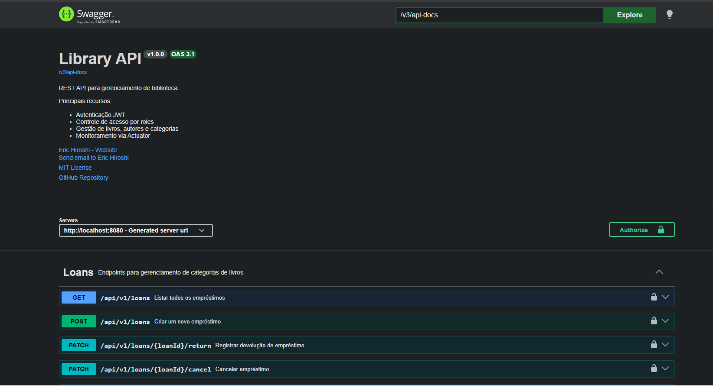
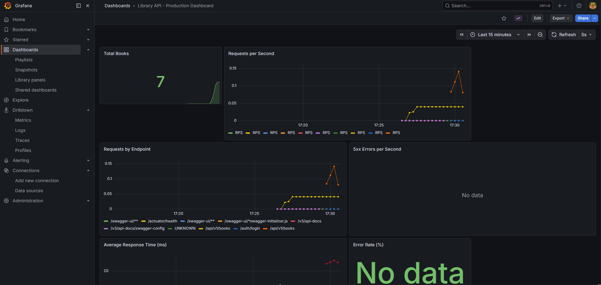
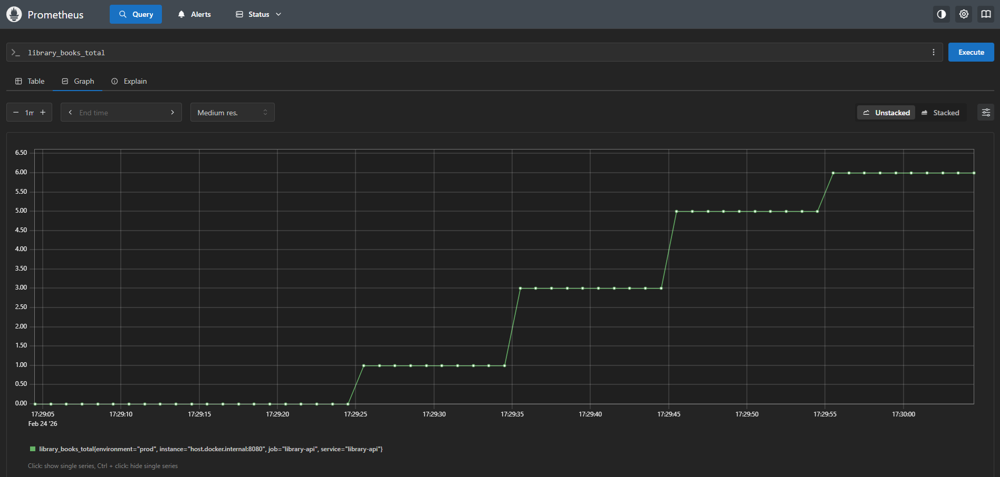

> Este documento é a versão técnica da documentação do projeto,
> utilizada para geração do PDF via CI.

# Library API — Spring Boot 4 + JWT + Docker + Observability

Backend production-ready projetado com foco em previsibilidade, observabilidade e isolamento de responsabilidades.

Autenticação JWT com Refresh Token Rotation  
Arquitetura em camadas bem definida  
PostgreSQL + Flyway (versionamento automático)  
Cache distribuído com Redis  
Observabilidade completa (Micrometer + Prometheus + Grafana)  
Testes de integração com Testcontainers (banco real)  
CI/CD com quality gate obrigatório (80%+ cobertura)  
Upload de imagens de capa com AWS S3  

---

## Índice

- [Visão Geral](#-visão-geral)
- [Requisitos](#-requisitos)
- [Quick Start](#-quick-start)
  - [Modo Desenvolvimento](#-modo-desenvolvimento-recomendado-para-avaliação)
  - [Modo Produção](#-modo-produção-simulado)
- [Variáveis de Ambiente](#-variáveis-de-ambiente)
- [Problema que Resolve](#-problema-que-este-projeto-resolve)
- [Stack Tecnológica](#-stack-tecnológica)
- [Arquitetura](#-arquitetura)
- [Decisões Arquiteturais](#-decisões-arquiteturais)
- [Observabilidade](#-observabilidade)
- [Estratégia de Testes](#-estratégia-de-testes)
- [Endpoints Principais](#-endpoints-principais)
- [Upload de Imagens (AWS S3)](#-upload-de-imagens-aws-s3)
- [Agendamentos (Scheduled Jobs)](#-agendamentos-scheduled-jobs)
- [Métricas do Projeto](#-métricas-do-projeto)
- [Próximos Passos](#-próximos-passos)
- [Screenshots](#-screenshots)
- [Contribuições](#-como-contribuir)
- [Autor](#autor)

---

## Requisitos

### Obrigatórios
- **Docker** 20.10+ & **Docker Compose** 2.0+
- **Git** 2.30+

### Opcional (apenas para rodar fora do Docker)
- **Java 25** (Eclipse Temurin recomendado)
- **Gradle** 9+ (ou use o wrapper `./gradlew`)

### Verificar Instalação
```bash
docker --version          # Docker version 20.10+
docker compose version    # Docker Compose version 2.0+
git --version             # git version 2.30+
```

---

## Visão Geral

A **Library API** simula um backend de produção real para gerenciar livros, autores, categorias, usuários e empréstimos. Vai além de um CRUD — implementa segurança, cache distribuído, observabilidade, upload de arquivos e CI/CD completo.

---

## Quick Start

O projeto possui dois modos de execução:

- **dev** → ambiente voltado para desenvolvimento e avaliação
- **prod** → ambiente containerizado simulando produção

---

### Clone o projeto

```bash
git clone https://github.com/erichiroshi/library-api.git
cd library-api
```

### Modo Desenvolvimento (recomendado para avaliação)

Nesse modo a infraestrutura é executada via Docker e a aplicação pode ser iniciada via container ou IDE.

#### 1️Subir infraestrutura

```bash
docker compose -f docker-compose.dev.yml up -d
```

A rede `library-api_backend` é criada automaticamente.

**Serviços iniciados:**
- PostgreSQL: `localhost:5432`
- Redis: `localhost:6379`
- pgAdmin: http://localhost:5050 (login `admin@admin.com` / `admin`)
- Prometheus: http://localhost:9090
- Grafana: http://localhost:3000 (login `admin` / `admin`)

#### 2️Subir aplicação

**Opção A — Container:**
```bash
docker build -t library-api:latest .
docker run -d --network library-api_backend -p 8080:8080 --env-file .env.dev library-api:latest
```

**Opção B — IDE:**
```bash
./gradlew clean build
```
Refresh Gradle project → Executar a aplicação

**Acesse:**
- API: http://localhost:8080/api/v1
- Swagger: http://localhost:8080/swagger-ui/index.html

**Usuário admin para teste:**  
Email: `joao.silva@email.com`  
Senha: `123456`

**Características do profile `dev`:**
- Swagger habilitado
- Banco populado com seed inicial (Flyway)
- Delay artificial de 2s no `GET /books/{id}` para demonstrar cache Redis
- Access token de 30 minutos (mais conveniente)
- Logs detalhados (DEBUG)

---

## Modo Produção (simulado)

Executa toda a stack containerizada utilizando o profile `prod`.

```bash
docker compose up -d
```

**Características do profile `prod`:**
- ✅ Swagger desabilitado
- ✅ Banco de dados inicial vazio
- ✅ Configuração mais restritiva (HikariCP tunado)
- ✅ Ambiente totalmente containerizado
- ✅ Stateless (JWT) + cache compartilhado (Redis)
- ✅ Access token de 15 minutos
- ✅ Apenas endpoints `/actuator/health` e `/actuator/prometheus` públicos

**Populando banco em prod:**
```bash
docker exec -i library-api-postgres-1 psql -U postgres -d library < seed_realistic_dataset.sql
```

---

## Encerrar ambiente

```bash
docker compose down          # Para os containers
docker compose down -v       # Para e remove volumes (apaga banco)
```

---

## Variáveis de Ambiente

Copie o arquivo de exemplo e preencha:

```bash
cp .env.example .env
```

| Variável | Descrição | Exemplo |
|---|---|---|
| `SPRING_PROFILES_ACTIVE` | Profile ativo | `prod` ou `dev` |
| `DB_URL` | URL JDBC do PostgreSQL | `jdbc:postgresql://postgres:5432/library` |
| `DB_USERNAME` | Usuário do banco | `postgres` |
| `DB_PASSWORD` | Senha do banco | `postgres` |
| `JWT_SECRET_KEY` | Chave secreta JWT (mín. 256 bits) | — |
| `REDIS_HOST` | Host do Redis | `redis` |
| `REDIS_PORT` | Porta do Redis | `6379` |
| `AWS_KEY` | AWS Access Key ID | — |
| `AWS_SECRET` | AWS Secret Access Key | — |
| `BUCKET_NAME` | Nome do bucket S3 | `library-api-s3` |
| `BUCKET_REGION` | Região do bucket | `sa-east-1` |

> O arquivo `.env` está no repositório **apenas para fins educacionais**. Em produção real, use um secrets manager (AWS Secrets Manager, HashiCorp Vault, etc.).

---

## Postman Collection

Importe a collection para testar a API:

`Library-API.postman_collection.json` (na raiz do projeto)

---

## Problema que este Projeto Resolve

Este projeto vai além de um CRUD básico — ele **simula desafios reais de produção**:

### Cenário de Negócio
Uma biblioteca precisa:
- Gerenciar empréstimos com regras (controle de cópias disponíveis)
- Autenticar usuários de forma segura (JWT + Refresh Token Rotation)
- Garantir performance em consultas frequentes (Cache Redis)
- Armazenar imagens de capa dos livros (AWS S3)
- Monitorar saúde e métricas da aplicação (Observabilidade)
- Garantir qualidade de código (80%+ cobertura obrigatória)
- Evoluir schema sem quebrar produção (Flyway migrations)
- Limpar dados expirados automaticamente (Scheduled Jobs)

### Diferenciais Técnicos
- Segurança: JWT com token rotation (previne replay attacks)
- Performance: Cache distribuído com Redis + atomic decrement de cópias
- Observabilidade: Prometheus + Grafana (dashboards prontos)
- Storage: Upload de imagens com compressão automática via AWS S3
- Qualidade: 80%+ cobertura com threshold obrigatório no CI
- CI/CD: Quality gate automático (SonarCloud + Codecov)
- DevOps: Docker Compose com 6 serviços orquestrados

---

## Stack Tecnológica

### Core
- **Java 25**
- **Spring Boot 4.x**
  - Spring Web MVC (API REST)
  - Spring Data JPA (persistência)
  - Spring Security (JWT)
  - Spring Cache (Redis)
  - Spring Actuator (health + métricas)
- **Hibernate** (ORM)
- **Lombok** (redução de boilerplate)

### Persistência
- **PostgreSQL 16** (banco relacional)
- **Flyway** (versionamento de schema — 6 migrations)

### Cache
- **Redis 7** (cache distribuído com TTL de 2 minutos)

### Storage
- **AWS S3** (upload de imagens de capa)
  - Compressão e redimensionamento automático (máx. 400px de largura)
  - Validação de content-type (PNG, JPEG, WEBP)
  - Validação de tamanho (1KB mín. / 10MB máx.)
  - Metadados automáticos no objeto S3

### Observabilidade
- **Spring Actuator** (health checks)
- **Micrometer** (abstração de métricas)
- **Prometheus** (coleta de métricas, scrape a cada 10s)
- **Grafana** (dashboards provisionados automaticamente)

### Testes
- **Testcontainers** (PostgreSQL real em testes de integração)
- **JUnit 5**
- **Mockito**
- **JaCoCo** (cobertura com threshold de 80%)

### Infraestrutura
- **Docker & Docker Compose** (6 serviços orquestrados)
- **GitHub Actions** (CI/CD — 4 workflows)
- **Dependabot** (atualização automática de dependências)

### Documentação e Qualidade
- **Swagger/OpenAPI 3** (habilitado no profile `dev`)
- **SonarCloud** (quality gate)
- **Codecov** (tracking de cobertura)

### Serialização e Mapeamento
- **Jackson** (JSON, com `non_null` por padrão)
- **DTOs** (isolamento de domínio)
- **MapStruct** (mapeamento automático)
- **Bean Validation** (validação declarativa)

---

## Arquitetura

### Camadas

```
┌─────────────────────────────────────────────┐
│         Controllers (REST Layer)            │
│   @RestController / @RequestMapping         │
│   • BookController                          │
│   • LoanController                          │
│   • AuthController                          │
│   • AuthorController                        │
│   • CategoryController                      │
└──────────────┬──────────────────────────────┘
               │ DTOs (Request/Response)
┌──────────────▼──────────────────────────────┐
│         Services (Business Logic)           │
│   @Service / @Transactional                 │
│   • BookService                             │
│   • LoanService                             │
│   • AuthService / RefreshTokenService       │
│   • S3Service                               │
└──────────────┬──────────────────────────────┘
               │ Entities
┌──────────────▼──────────────────────────────┐
│      Repositories (Data Access)             │
│        JpaRepository                        │
│   • BookRepository                          │
│   • LoanRepository                          │
│   • UserRepository                          │
│   • RefreshTokenRepository                  │
└──────────────┬──────────────────────────────┘
               │
┌──────────────▼──────────────────────────────┐
│       PostgreSQL + Redis + AWS S3           │
└─────────────────────────────────────────────┘
```

### Estrutura de Pacotes (Feature-based)

```
com.example.library/
├── auth/           # Autenticação (login, refresh, logout)
├── author/         # Gerenciamento de autores
├── aws/            # Integração AWS S3 + utilitários de imagem
├── book/           # Gerenciamento de livros (com cache)
├── category/       # Gerenciamento de categorias
├── common/         # BaseEntity, exceções, configurações comuns
├── config/         # CacheConfig, JpaConfig, SchedulingConfig
├── loan/           # Empréstimos e itens de empréstimo
├── refresh_token/  # Refresh tokens + cleanup job agendado
├── security/       # JWT filter, SecurityConfig, profiles dev/prod
├── swagger/        # Configuração OpenAPI
└── user/           # Entidade User + UserDetailsService
```

### Fluxo de Observabilidade

```
Application → Actuator → Micrometer → Prometheus → Grafana
                                                      ↓
                                                  Dashboards
```

### Estratégia de Cache

```
Request → Controller → Service → [Cache Hit? → Return]
                          ↓
                      Cache Miss
                          ↓
                     Repository → PostgreSQL
                          ↓
                      [Cache Store no Redis]
```

**Caches configurados:**
- `books` — lista paginada (evict ao criar/deletar)
- `bookById` — busca por ID (evict ao deletar)
- TTL global: 2 minutos

---

## Decisões Arquiteturais

### ✔ Decrement atômico de cópias
**Por quê:** Evitar race condition em empréstimos concorrentes.

**Implementação:** `@Modifying` com `UPDATE ... WHERE availableCopies > 0` — o banco rejeita o UPDATE se não há cópias, sem necessidade de lock explícito. `clearAutomatically = true` invalida o cache de 1º nível do JPA após o UPDATE.

### ✔ Separação Controller / Service / Repository
**Por quê:** Evita vazamento de regra de negócio para a camada HTTP.

**Benefício:** Regras podem ser reutilizadas por diferentes camadas (REST, scheduled jobs, listeners).

### ✔ DTOs + MapStruct
**Por quê:** Isolamento de domínio e controle explícito de exposição.

**Benefício:** Entidades JPA nunca expostas diretamente — previne lazy loading exceptions e vazamento de dados sensíveis.

### ✔ Cache no nível de serviço
**Por quê:** Independente da camada web.

**Benefício:** Cache funciona se chamado por REST, mensageria ou scheduled job.

### ✔ `LoanUnauthorizedException` retorna 404
**Por quê:** Segurança — não revelar que um empréstimo existe quando o usuário não tem permissão para acessá-lo.

### ✔ Delay artificial no profile `dev`
**Por quê:** Demonstrar o efeito do cache Redis de forma perceptível.

**Implementação:** Interface `ArtificialDelayService` com duas implementações — `DevArtificialDelayService` (2s de sleep) e `NoOpArtificialDelayService` — selecionadas por `@Profile`.

### ✔ Testcontainers
**Por quê:** Banco real nos testes de integração.

**Benefício:** Testes simulam produção (PostgreSQL real), não comportamento idealizado do H2 in-memory.

### ✔ Threshold de cobertura obrigatório
**Por quê:** Pipeline falha abaixo de 80%.

**Benefício:** Garante qualidade mínima em cada PR, evitando degradação gradual.

### ✔ Feature-based packages
**Por quê:** Preparação para extração em microservices.

**Benefício:** Código relacionado fica junto; cada pacote é praticamente auto-contido.

---

## Observabilidade

**Métricas expostas:**
- JVM (memória, threads, GC)
- HTTP (requests, latência, status codes)
- Database (pool de conexões)
- Cache Redis (hits, misses, evictions)
- Custom de negócio (ver abaixo)

**Métricas customizadas de negócio:**
- `library.books.created` — Counter de livros criados

**Alertas configurados no Prometheus (`alerts.yml`):**
- `HighErrorRate` — taxa de erros 5xx acima de 0.05/s por 5 minutos (warning)
- `HighMemoryUsage` — uso de heap JVM acima de 90% por 5 minutos (critical)

**Dashboards Grafana (provisionados automaticamente):**
- Total de livros
- Requests por segundo (RPS)
- Requests por endpoint
- Erros 5xx por segundo
- Tempo médio de resposta (ms)
- Taxa de erro (%)

**Acesso:**
- Prometheus: http://localhost:9090
- Grafana: http://localhost:3000 (admin/admin)
- Métricas raw: http://localhost:8080/actuator/prometheus
- Health: http://localhost:8080/actuator/health

---

## Estratégia de Testes

**Pirâmide de Testes:**
```
       /\
      /  \  E2E (poucos)
     /____\
    /      \ Integration (médio)
   /        \
  /__________\ Unit (muitos)
```

### Unit Tests
- Isolamento de regra de negócio
- Mockito para dependências
- Foco em Services

### Repository Tests
- `@DataJpaTest` (context slice)
- Banco H2 in-memory (rápido)
- Valida queries customizadas (`findOverdueLoans`, `countActiveByUserId`, `decrementCopies`)

### Integration Tests
- `@SpringBootTest` (context completo)
- **Testcontainers** com PostgreSQL real
- Profile `it` — cache desabilitado (`@Profile("!it")` no `CacheConfig`)
- Valida fluxo end-to-end

**Cobertura atual:** 80%+  
**Threshold obrigatório:** 80% (pipeline falha se menor)  
**Exclusões de cobertura:** DTOs, configs, mappers gerados

**Executar testes:**
```bash
./gradlew test                  # Unit + Repository tests
./gradlew integrationTest       # Integration tests
./gradlew test integrationTest  # Todos os testes
./gradlew jacocoTestReport      # Gerar relatório de cobertura
```

Relatório HTML: `build/reports/jacoco/test/html/index.html`

---

## Endpoints Principais

### Autenticação
| Método | Endpoint | Descrição | Auth |
|--------|----------|-----------|------|
| POST | `/auth/login` | Login — retorna access + refresh token | ❌ |
| POST | `/auth/refresh` | Renova access token (token rotation) | ❌ |
| POST | `/auth/logout` | Invalida o refresh token | ❌ |

### Livros
| Método | Endpoint | Descrição | Auth |
|--------|----------|-----------|------|
| GET | `/api/v1/books` | Lista livros paginado (com cache Redis) | ✅ |
| GET | `/api/v1/books/{id}` | Busca por ID (com cache Redis) | ✅ |
| POST | `/api/v1/books` | Cria livro | ✅ |
| DELETE | `/api/v1/books/{id}` | Remove livro | 🔐 ADMIN |
| POST | `/api/v1/books/{id}/picture` | Upload de imagem de capa (S3) | ✅ |

### Autores
| Método | Endpoint | Descrição | Auth |
|--------|----------|-----------|------|
| GET | `/api/v1/authors` | Lista autores paginado | ✅ |
| GET | `/api/v1/authors/{id}` | Busca por ID | ✅ |
| POST | `/api/v1/authors` | Cria autor | ✅ |
| DELETE | `/api/v1/authors/{id}` | Remove autor | 🔐 ADMIN |

### Categorias
| Método | Endpoint | Descrição | Auth |
|--------|----------|-----------|------|
| GET | `/api/v1/categories` | Lista categorias paginado | ✅ |
| GET | `/api/v1/categories/{id}` | Busca por ID | ✅ |
| POST | `/api/v1/categories` | Cria categoria | 🔐 ADMIN |
| DELETE | `/api/v1/categories/{id}` | Remove categoria | 🔐 ADMIN |

### Empréstimos
| Método | Endpoint | Descrição | Auth |
|--------|----------|-----------|------|
| POST | `/api/v1/loans` | Cria empréstimo | ✅ |
| GET | `/api/v1/loans/{id}` | Busca por ID (apenas dono ou ADMIN) | ✅ |
| GET | `/api/v1/loans/me` | Lista meus empréstimos | ✅ |
| GET | `/api/v1/loans` | Lista todos os empréstimos | 🔐 ADMIN |
| GET | `/api/v1/loans/user/{userId}` | Lista empréstimos por usuário | 🔐 ADMIN |
| GET | `/api/v1/loans/overdue` | Lista empréstimos vencidos | 🔐 ADMIN |
| PATCH | `/api/v1/loans/{id}/return` | Registra devolução | ✅ |
| PATCH | `/api/v1/loans/{id}/cancel` | Cancela empréstimo | ✅ |

**Documentação interativa (profile dev):** http://localhost:8080/swagger-ui/index.html

---

## Upload de Imagens (AWS S3)

### Como funciona

```
POST /api/v1/books/{id}/picture
Content-Type: multipart/form-data
```

O pipeline de upload:
1. Validação de tamanho (1KB mín. / 10MB máx.)
2. Validação de content-type (`image/png`, `image/jpeg`, `image/webp`)
3. Redimensionamento automático para máx. 400px de largura (mantém aspect ratio)
4. Upload para S3 com metadados (`uploaded-by`, `original-filename`, `upload-timestamp`)
5. URL pública salva em `tb_book.cover_image_url`
6. URL retornada no header `Location`

### Configuração AWS

Para usar o S3, você precisa de credenciais AWS com permissão de `s3:PutObject` e `s3:GetObject` no bucket configurado.

```bash
# No .env ou variáveis de ambiente:
AWS_KEY=sua-access-key
AWS_SECRET=seu-secret
BUCKET_NAME=seu-bucket
BUCKET_REGION=sa-east-1
```

> Para desenvolvimento local sem AWS, você pode usar [LocalStack](https://localstack.cloud/) como alternativa.

---

## Agendamentos (Scheduled Jobs)

### RefreshTokenCleanupJob

Limpa automaticamente refresh tokens expirados do banco de dados.

- **Frequência:** Todo dia às 02:00 AM (`cron = "0 0 2 * * *"`)
- **O que faz:** `DELETE FROM tb_refresh_tokens WHERE expiry_date < NOW()`
- **Por quê:** Tokens expirados são deletados ao serem usados (via `validate()`), mas tokens nunca reutilizados acumulam no banco.

### LoanService.markOverdue()

Marca como `OVERDUE` empréstimos com `status = WAITING_RETURN` e `dueDate < hoje`.

> O método `markOverdue()` está implementado no `LoanService` e pode ser exposto via `@Scheduled` ou endpoint admin conforme necessidade.

---

## Métricas do Projeto

- **~8.000** linhas de código
- **125+** testes (unit + integration)
- **80%+** cobertura (JaCoCo)
- **30+** endpoints REST versionados (`/api/v1`)
- **6** serviços Docker orquestrados
- **6** migrations Flyway
- **4** workflows GitHub Actions (CI, Docker, Release, README PDF)

---

## Próximos Passos

- [ ] **Rate limiting** — Bucket4j ou Resilience4j
- [ ] **OpenTelemetry** — Tracing distribuído
- [ ] **Deploy em cloud** — AWS ECS ou Render
- [ ] **HATEOAS** — Hypermedia links
- [ ] **WebSockets** — Notificações real-time de devolução
- [ ] **Microservices** — Extração em serviços independentes
- [ ] **LocalStack** — Suporte a S3 local em testes de integração

---

## Screenshots

### Swagger UI


### Grafana Dashboard


### Prometheus Metrics


---

## Como Contribuir

Contribuições são muito bem-vindas!

### Para Iniciantes
Issues marcadas com `good-first-issue`:
- [EASY] Adicionar endpoint `GET /books/search?title=`
- [EASY] Melhorar mensagens de erro de validação
- [MEDIUM] Adicionar paginação customizada nas loans

### Para Experientes
- [HARD] Implementar rate limiting (Bucket4j)
- [HARD] Adicionar tracing distribuído (OpenTelemetry)
- [HARD] Suporte a LocalStack nos testes de integração

### Processo de Contribuição

1. **Fork o repositório**
```bash
git clone https://github.com/SEU-USER/library-api.git
```

2. **Crie uma branch de feature**
```bash
git checkout -b feature/nova-funcionalidade
```

3. **Faça suas mudanças**
   - Adicione testes (cobertura mínima 80%)
   - Rode `./gradlew test integrationTest`
   - Verifique qualidade: `./gradlew sonar`

4. **Commit seguindo Conventional Commits**
```bash
git commit -m "feat: adiciona endpoint de busca avançada"
```

5. **Push e abra um Pull Request**
```bash
git push origin feature/nova-funcionalidade
```

**PRs são revisados em até 48h com feedback construtivo garantido.**

---

## Autor

**Eric Hiroshi**  
Backend Engineer — Java / Spring Boot

- LinkedIn: [Eric Hiroshi](https://www.linkedin.com/in/eric-hiroshi/)
- Email: erichiroshi@hotmail.com
- GitHub: [@erichiroshi](https://github.com/erichiroshi)

---

## Licença

Este projeto está sob a licença [MIT](LICENSE).

---

## Documentação em PDF

A versão em PDF é gerada automaticamente via GitHub Actions e está disponível na aba **[Releases](https://github.com/erichiroshi/library-api/releases)** e como artefato nos workflows.

---

<p align="center">
  <em>"Código limpo é aquele que expressa a intenção com simplicidade e precisão."</em>
</p>

---

## Star o Projeto

Se este projeto te ajudou de alguma forma, considere dar uma estrela no repositório!

---

**Dúvidas?** Abra uma [issue](https://github.com/erichiroshi/library-api/issues/new) ou me chame no [LinkedIn](https://www.linkedin.com/in/eric-hiroshi/)!
